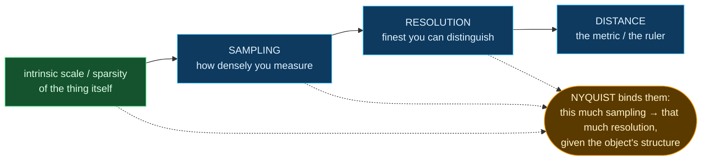

# The conceptual core — distance, resolution, sampling

Companion to [talk_flow.md](talk_flow.md). This is the rigor under the metaphor. If this holds, the braid is real; if it doesn't, it's a pun.

## They are not the same — they are one chain

| | what it is | one line |
|---|---|---|
| **distance** | the metric | the *ruler* — what "apart" means |
| **resolution** | finest distinguishable separation | how finely the ruler is *marked* (a floor on distance) |
| **sampling** | density of measurement | how many marks you actually *read* (it sets the resolution) |

## The honest band — the drama

False structure can be manufactured from **either end**:

- resolution finer than sampling supports → **hallucination** (detail from *priors*)
- sampling coarser than the object needs → **aliasing** (false structure from *data*) + **amnesia** (real features lost)

The skill is staying inside the band: *which detail is measurement, which is my model's decision?*

## The 3 × 3 — how the loop's verbs act on each

|  | on **distance** | on **resolution** | on **sampling** |
|---|---|---|---|
| **loss** | a loss *is* a distance-to-target; choosing the metric chooses what counts as error (L2 vs perceptual) | resolution *floors* the loss — the last bit of loss reduction is where honesty dies | sparse features → sufficient sampling → forgetting is lossless (compressed sensing) |
| **optimization** | wrong metric → you converge to the wrong place | learning rate = resolution in *parameter* space; steep slope → tiny steps | SGD *samples* the landscape (minibatches); batch size = sampling rate of the loss surface |
| **modeling** | a model = a *learned distance* (the embedding puts similar things close) | super-resolution = manufacturing resolution from priors — **the site of hallucination** | the pipeline *is* the sampling decision: what to keep, made in advance (petabytes → kilobytes) |

## How this maps onto the loop (it doesn't replace it — it arms it)

- **distance** = stage ① of the loop (the ruler you pick).
- **resolution + sampling** = the two knobs of stage ④ (model = forget). Resolution = "how fine do I claim to see"; sampling = "how much do I keep." Nyquist relates them.
- the **hallucinate ↔ alias/amnesia** symmetry is the emotional/scientific core of the forgetting stage.
- **the question moving** (stage ⑤) = the object's intrinsic scale changing, or you deciding a finer scale matters — which resets what sampling/resolution you need.

## Across domains (the woven examples, now with rigor)

| | 🔭 astronomy | 🤖 AI | 🧑 person / brain |
|---|---|---|---|
| **distance** | redshift assigns your rung | metric in latent space | how close you stand |
| **resolution** | pc vs kpc → different physics | detail the model claims | a flaw vs a stranger |
| **sampling** | how many photons / epochs | data kept / batch | time spent; how much you take in |
| **the honest band** | is that clump real, or the PSF? | is that pixel physics, or prior? | do I know them, or my projection? *(and: is that a memory, or a reconstruction?)* |
