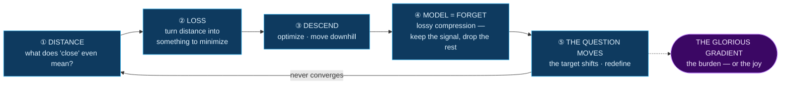
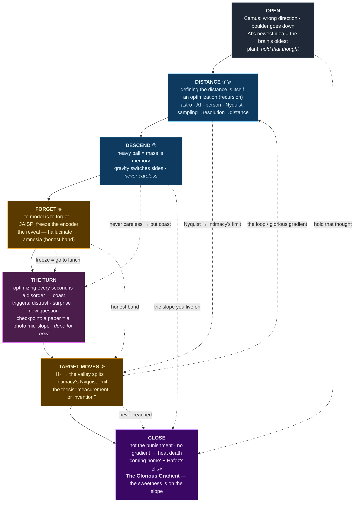

# GISS 2026 — Structure

Start simple. The **bone** is one loop: the optimization cycle. Everything else is an example hung on it.

---

## 1. The bone — the optimization loop

In words: **you pick a distance → a loss falls out of it → you descend → to descend you must model, and to model is to forget (compression is lossy) → then the question itself moves, so you redefine and descend again.** It never converges. That non-convergence is the glorious gradient — the burden or the joy, depending on how you look at it.

---

## 1b. The causal graph — the delivered arc (matches the deck's 7 sections)

Solid = the talk's forward flow. Dashed = plant → payoff (set up early, paid later). The dotted back-edge is the loop itself.

**Read it for:** the spine is monotonic (Open→…→Close), but the *loop-back* (Target→Distance) is what makes it Sisyphus. The Close plants nothing — it's all harvest. **The Turn** is the new keystone: it subverts "optimize forever" and is fed by both Descend (never careless → *but* coast) and Forget (freeze the model → go to lunch).

---

## 2. The examples — domains hung on the loop

Three domains illustrate the same loop:

- 🔭 **Astronomy** — the distance/resolution ladder, the pipeline, the Hubble tension
- 🤖 **AI** — the literal machine that does all of this
- 🧑 **Person / brain / relationships** — the brain as a prediction-error minimizer & lossy codec (cognition), and knowing someone (the heart)

The point of the talk: **it's the same loop every time.** The examples rhyme.

---

## 3. The matrix — which example illustrates which stage

Rows = the loop's stages. Columns = domains. Cells = the concrete beat.
(Empty cells are fine — they tell us which domain is a *full-loop* example and which is just a vivid illustration of one stage.)

| stage | 🔭 astronomy | 🤖 AI | 🧑 person / brain / relationships |
|---|---|---|---|
| **① distance** | distance ladder → resolution ladder; redshift picks your rung | similarity metric in latent space (the embedding) | how close you stand to someone; the brain's just-noticeable-difference |
| **② loss** | minimize distance uncertainty, then resolution | reconstruction error / the objective | closing the distance to someone; the brain as a **prediction-error minimizer** (predictive coding) |
| **③ descend** | a century down the ladder | gradient descent; heavy ball = momentum = **mass is memory** | showing up, spending time; updating your model of someone |
| **④ model = forget** | pipeline: petabytes → kilobytes; what to keep per source | super-res (**hallucinate**) ↔ amnesia; foundation-model compression (JAISP) | memory is lossy; you complete people from priors (projection); the brain fills its blind spot — **perception as controlled hallucination** |
| **⑤ question moves** | H₀ → the valley **splits**; universe expands, rungs recede | non-stationary target; can't know tomorrow's loss | people change; you outgrow what you asked |

---

## 4. The throughline — the glorious gradient

Not a stage; the thing that runs under all of it. Because the loop never converges:

- **Nyquist / enough** — sufficient sampling, not infinite resolution (for a galaxy *and* for a person)
- **Checkpoint authority** — "done for now" is a *declaration*, not a convergence (a paper; a project; deciding you know someone)
- **Paid by the slope** — no gradient → no work is even possible (thermodynamics); the ghazal / فراق; the silver medalist
- The universe raising the landscape isn't cruelty — it's the payroll.

---

## 5. Carryover — strong v4 beats to consciously re-home

Going modular backgrounded these. They must be re-placed, not lost.

1. **⚠️ The Sisyphus engine (highest priority).** Descend *with* the boulder → **gravity switches sides**: downhill it's the boulder's ally against you; labor inverts from *pushing* to *restraining*; released downhill it accelerates = **divergence / exploding gradients**. The curse: *never allowed to be careless, especially when the direction looks easy.* → Home: the **opening/engine** (before the loop) + colors **stage ③ descend**. Pairs with "steepest slope = move slowest."
2. **The refrain-break (structural).** v4 broke the loop in the person domain (anticipate-then-subvert). Woven structure walks the loop once → no home. Re-home: at the **end**, the loop that always restarts **terminates by choice** for the person (→ checkpoint authority). Decide how to stage.
3. **Telescope vs priors + the line.** *"Two ways to get closer: gather more photons, or fill the gaps from your priors — most of us do the second and call it the first."* Rhymes astro (telescope vs learned priors) ↔ person (show up vs model-enhance). → Home: **stage ④**, both astro and person cells.
4. **"A paper is a photograph of the boulder mid-slope."** *Midway is the only place a paper can ever be written* → dissolves the guilt of publishing before "done." Kind to the room. → Home: **stage ④ / checkpoint throughline**, on the JAISP beat.
5. **The self-referential podium move (the brand).** *"You see me at podium resolution, which I've selected carefully" / "I don't pick the rung — you choose the distance you see me from."* A talk about modeling should turn on itself (cf. 2024 "black box," 2025 "mapped my mind"). → Home: **person domain**, late; candidate closer beat.

Minor: the "dynamic universe" **triple-register** pun (cosmologist / ML / everyone); the cold-open *"Camus got one thing wrong about Sisyphus — the direction."*

---

## Decision locked ✅ — the loop is the spine, domains are woven

The talk **walks the loop once**, and at each stage shows the same idea across domains. This replaces the v4 three-descents-by-domain structure.

**Why woven wins:** a listener who doesn't care about astro still follows everything, because *the person* is the accessible anchor at every stage. GISS is open to non-scientists — the person is the decoder ring for the whole room.

**Ordering principle (applies to every stage): 🔭 astro → 🤖 AI → 🧑 person.**
> Astronomy states the beat concretely, AI shows it's the *same machine* ("whoa, it rhymes"), and the **person lands it** — the recurring emotional close of every stage, and the overall climax.

So the person is present *throughout* (woven) **and** always lands last — per stage and for the whole talk (the glorious gradient / the ghazal at the very end).

*Open tradeoff:* person-last maximizes emotional payoff; person-*first* would maximize accessibility for the non-astro half of the room (person as decoder ring). Default is person-last; can flip per-stage if a beat needs the intuition pump up front.

---

Appendix — detailed callback map (from the v4 pass; revisit later, not needed yet)

The earlier plant→payoff analysis (painting→person, resolution-question→telescope-vs-priors, Nyquist→the-break, "reward-in-the-gradient"→paid-by-the-slope, etc.) is preserved in git history. We'll re-derive it against the new bone once the bone is locked.

